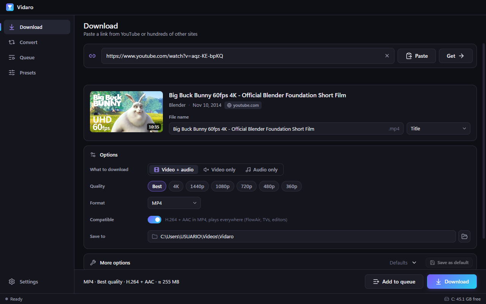
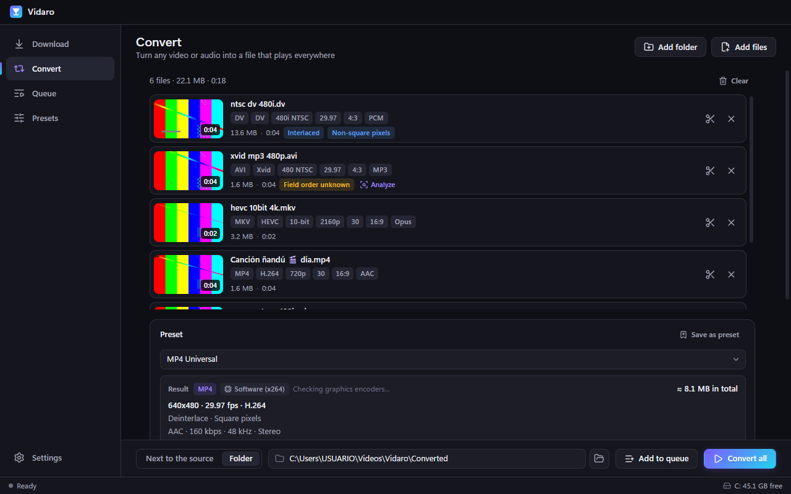
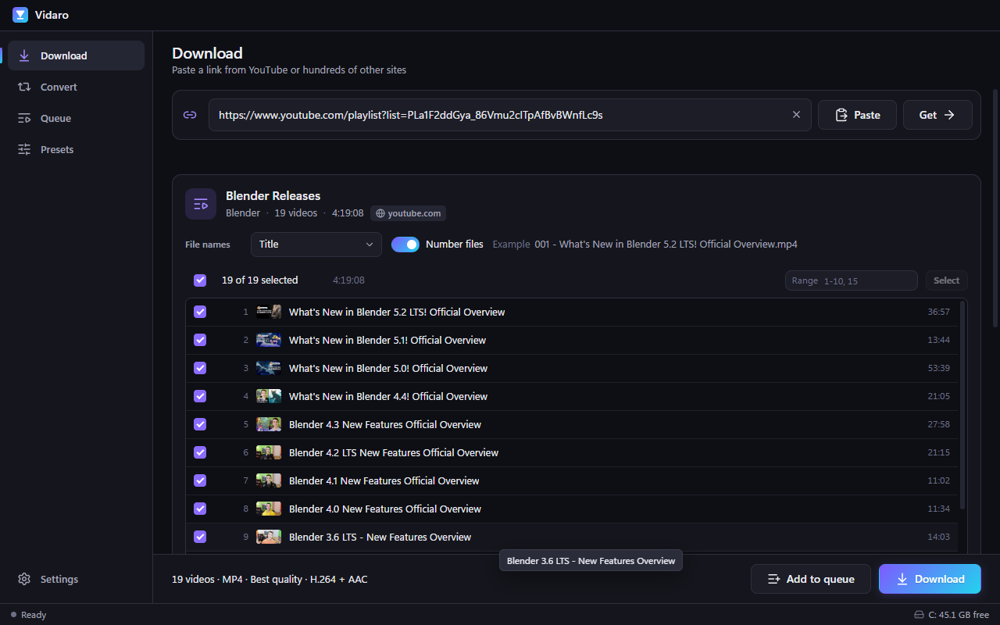
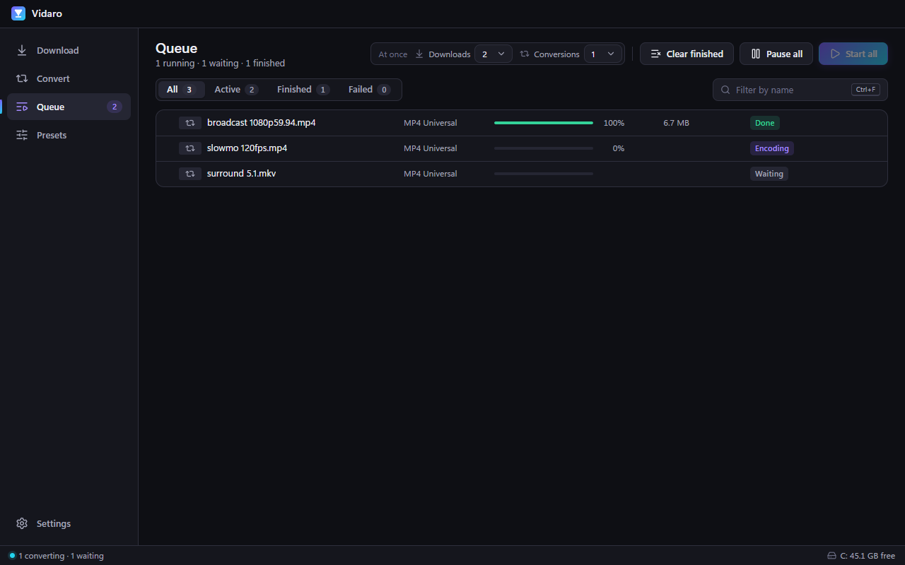

<p align="center">
  
</p>

<h1 align="center">Vidaro</h1>

<p align="center">Download and convert video on Windows, in one clean app.</p>

---

Vidaro saves videos and music from links, and turns any media file into one that plays everywhere. Paste a link from YouTube or one of the hundreds of other sites supported by yt-dlp, name the file however you want, and pick the quality. Or drop in an old AVI, a DV tape capture or an NTSC/PAL SD file and get a clean MP4 or MP3.

<p align="center">
  
  
</p>
<p align="center">
  
  
</p>

## Features

### Downloader
- Paste a link and preview the title, channel, duration and thumbnail before downloading
- **Choose the file name**: type it, or use a template such as *Channel - Title* or *Date - Title*
- Video + audio, video only or audio only (MP3, M4A, Opus, WAV, FLAC), in any available quality up to 4K
- A *Compatible* mode that prefers MP4 (H.264 + AAC), so files play on any TV, phone or editor
- Playlists and channels, with the items you want selected
- Subtitles, embedded thumbnails, metadata and chapters, time ranges, speed limit, cookies for private content
- Pause and resume downloads without starting over
- The download engine updates itself once a day, so sites keep working without reinstalling Vidaro

### Converter
- See what a file really contains: codec, resolution, aspect ratio, frame rate, interlacing, audio format
- Convert AVI, MKV, MOV, WMV, FLV, MPEG, TS, DV, VOB and more to MP4, MKV, MOV or WebM
- Extract or convert audio to MP3, M4A, WAV, FLAC or Opus
- Choose resolution, frame rate, bitrate or quality, codec and audio settings, or just pick a preset
- Made for archive material: deinterlacing, inverse telecine, correct 4:3 and 16:9 handling, SD to HD color conversion and loudness normalization
- Uses the graphics card when there is one (Intel Quick Sync, NVIDIA NVENC, AMD AMF) and falls back to the processor automatically
- Every converted file is checked before it is saved
- Save your own presets and share them as files
- Convert automatically after a download

### Queue
- Downloads and conversions in one list: one after another, or several at a time
- Pause, resume, cancel, retry and reorder jobs
- Nothing is lost when you close Vidaro or the power goes out: unfinished jobs come back and can be resumed
- Optional notification, sleep or shutdown when the queue finishes

### App
- Dark, compact interface built for the keyboard, with customizable shortcuts
- Discreet in-app update notices, never a popup
- Clean installation and uninstallation, no leftover processes

## Install

1. Download **Vidaro-Setup.exe** from [Releases](https://github.com/BrandSilva/Vidaro/releases/latest)
2. Run it. Windows may show **"Windows protected your PC"** because the app is not code-signed yet: click **More info**, then **Run anyway**
3. Choose whether to install Vidaro only for you (no administrator rights needed) or for all users

Everything Vidaro needs is included. There is nothing else to install. Conversions work without an internet connection; downloads and update checks need one.

**Requirements:** Windows 10 or Windows 11, 64-bit.

### Security notes
- Vidaro is not code-signed yet. On Windows 11, **Smart App Control** can block apps that are not signed; if it does, Vidaro cannot run while Smart App Control is on.
- Some antivirus engines flag `yt-dlp.exe` as a false positive because it is packaged with PyInstaller. If downloads stop working after a scan, restore the file from quarantine or allow it; Vidaro also restores its own copy automatically.

## Updates

Vidaro checks GitHub for a new version a few seconds after it starts and every few hours. When one is available, a small **Update** button appears at the top of the window. Click it to download the update and install it. Your jobs are paused first, and your settings, presets and queue are kept.

The download engine (yt-dlp) updates itself separately, at most once a day. You can also update it from **Settings → yt-dlp**, where you can choose the *nightly* channel, which gets fixes for sites like YouTube first.

## Uninstall

Use **Settings → Apps** in Windows, or the uninstaller in the Start menu. Uninstalling removes Vidaro, its settings and its private copy of the download engine. **Your downloaded and converted files are never touched.** Updating Vidaro never deletes any data.

## Build from source

You need [Node.js](https://nodejs.org) 22.12 or newer.

```
START.bat
```

`START.bat` installs the dependencies, offers to download the bundled tools (`yt-dlp.exe`, `ffmpeg.exe`, `ffprobe.exe`) into `bin/`, and starts Vidaro in development mode. The tools are downloaded from their official releases and checked against pinned SHA-256 hashes; they are not stored in the repository.

Other commands:

| Command | What it does |
| --- | --- |
| `npm run fetch-binaries` | Download the bundled tools into `bin/` |
| `npm test` | Run the tests |
| `npm run dist` | Run the tests and build the installer into `Installer/Vidaro-Setup.exe` |

### Project structure

```
Vidaro/
├── src/main/      Main process: queue, downloader, converter, settings, updates
├── src/preload/   The safe bridge between the app window and the main process
├── src/renderer/  User interface (React)
├── test/          Automated tests
├── build/         Installer resources and build scripts
├── brand/         Logo sources
├── bin/           yt-dlp and FFmpeg (downloaded, not included in the repository)
└── START.bat      Development launcher
```

## Responsible use

Vidaro is a tool. Only download content you own, content that is in the public domain or under a license that allows it, or content you have permission to download. Respect the terms of service of each website and the copyright laws of your country.

## Built With

- [Electron](https://www.electronjs.org) and [React](https://react.dev) — desktop app
- [yt-dlp](https://github.com/yt-dlp/yt-dlp) — downloads ([Unlicense](https://github.com/yt-dlp/yt-dlp/blob/master/LICENSE))
- [FFmpeg](https://ffmpeg.org) — conversion and media analysis ([GPL v3](https://ffmpeg.org/legal.html), Windows build by [gyan.dev](https://www.gyan.dev/ffmpeg/builds/))
- [Lucide](https://lucide.dev) — icons
- Developed with [Claude Code](https://claude.com/claude-code)

## Made by TridentSky

Vidaro is made by [TridentSky](https://tridentsky.net/software). Need custom software or a website? [Get in touch](https://tridentsky.net/software).

## License

MIT License — see [LICENSE](LICENSE) for details.

yt-dlp and FFmpeg are independent projects with their own licenses. Their license texts are installed next to their executables.
